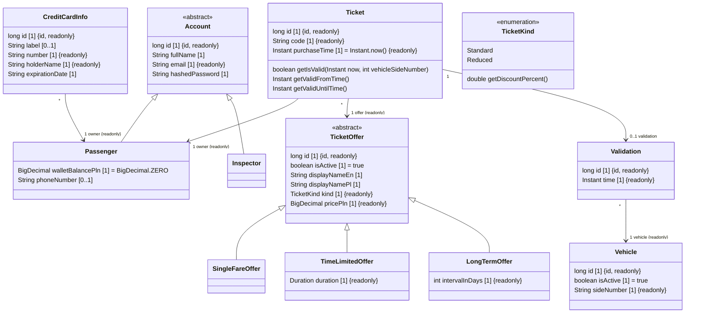

# Design specification for Online City Tickets

## Front end

### UI/UX design

- The app will use (not yet chosen) a component framework.
- The app's UI should be inspired by [jakdojade.pl](https://jakdojade.pl).

## Back end

### Component diagram

TODO

### Domain class diagram

### Database diagram

TODO

### Endpoints

TODO
